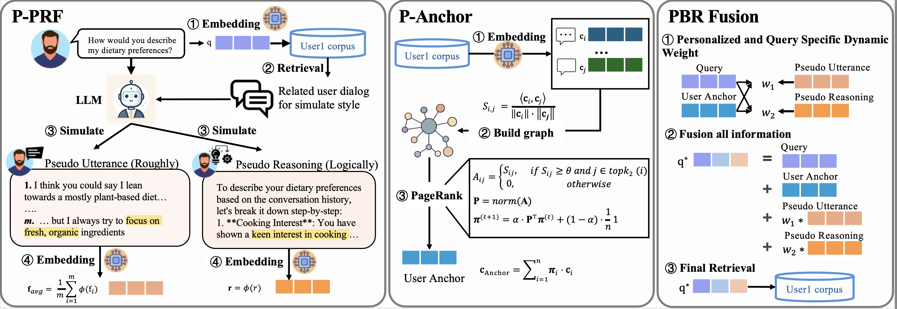

# PBR: Personalize-Before-Retrieve Framework for User-Centric Retrieval

This is repository provides the official implementation of the paper:

**Personalize Before Retrieve: LLM-based Personalized Query Expansion for User-Centric Retrieval**  



---

## 🌟 Overview

This project implements **PBR (Personalize Before Retrieve)** — a novel framework for personalized query expansion in Retrieval-Augmented Generation (RAG) systems. Unlike traditional expansion methods, PBR adapts to **individual user styles and corpus structures** before retrieval.

PBR consists of two core modules:

- **P-PRF**: simulates personalized query rewrites (utterances + reasoning) based on user history
- **P-Anchor**: builds a graph over user corpus and applies Personalized PageRank to ground queries structurally

We evaluate PBR on two personalized benchmarks: **PersonaBench** and **LongMemEval**, where it outperforms strong baselines such as HyDE, Query2Term, MILL, CoT, and ThinkQE across multiple retrievers.

---

## 🧠 Key Features

- 🔁 **LLM-based query expansion** with style-aware feedback and reasoning simulation
- 🧩 **Graph-enhanced memory retrieval** via PageRank and embedding fusion
- 🧪 Full evaluation pipeline with ablation, baselines, and parameter sensitivity
- 📊 Compatible with retrievers like `multi-qa-MiniLM`, `all-MiniLM`, `bge-base-en`

---

## 📦 Installation

Install required packages:

```bash
pip install -r requirements.txt
```

You’ll need:
	•	sentence-transformers, faiss-cpu
	•	openai, cvxpy, scikit-learn, ot, numpy, scipy
	•	a valid OpenAI API Key (for gpt-4o-mini)


## 📚 Usage - LongMemEval
### 1. download data
you need to download LongMemEval data to this dictionary form https://github.com/xiaowu0162/LongMemEval. 

For example: "./data/longmemeval_data/longmemeval_s.json".

### 2. run the code
```bash
python -u ./src/retrieval/retrieval_PBR.py \
    --model_type="PBR" \
    --retrieval_model_name="multi-qa-MiniLM-L6-cos-v1" \
    --data_type='s'

```

## 📚 Usage - personabench
### 1. run the code
```bash
cd ./personabench_main_PBR
SEED=2024
MODEL_TYPE="PBR" # fake_ada_reason_fake_10
LOG_DIR="PBR_all-mpnet-base-v2_new"
DATA_DIR="eval_data/eval_data_v1"
SAVE_DIR="PBR" 
TEST_COMMUNITY_IDS="community_0,community_1"
NUM_CHUNKS=5
BASE_MODELS="gpt-4o-mini"
RETRIEVERS="multi-qa-MiniLM-L6-cos-v1"
TEST_NOISES="0.0"
VERBOSE="--verbose"


CUDA_VISIBLE_DEVICES="0" python scripts/evaluation/eval_rag_PBR.py \
    --seed $SEED \
    --log_dir $LOG_DIR \
    --model_type $MODEL_TYPE \
    --data_dir $DATA_DIR \
    --save_dir $SAVE_DIR \
    --test_community_ids $TEST_COMMUNITY_IDS \
    --num_chunks $NUM_CHUNKS \
    --model_name $BASE_MODELS \
    --retrieval_model $RETRIEVERS \
    --noise $TEST_NOISES \
    $VERBOSE

```